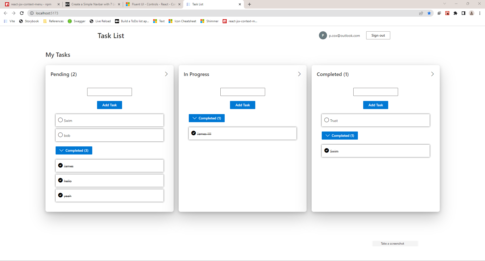

# TaskList - ASP.NET Core + ReactJS + FluentUI Example - By Peter Cox 💥

## Introduction

This project makes uses of an ASP.NET Core WebAPI backend, ReactJS front-end and the FluentUI UX framework for styling.

It enables the user to view a list of customers, add new customers, edit existing customers and delete customers.



## Technologies used

<div style="display: flex;flex-direction: row;gap:5px">

   <!-- C# Icon -->
   <a href="https://www.w3schools.com/cs/" rel="nofollow"> 
       
   </a>

   <!-- React Icon -->
   <a href="https://reactjs.org/" rel="nofollow"> 
   
    </a>

   <!-- TypeScript -->

<a href="https://www.typescriptlang.org/" rel="nofollow">  </a>

</div>

## How To Use ☄️

First, clone the project and open both the 'TaskList.Backend' and 'TaskList.Frontend' folders in Visual Studio and VSC respectively.

Make sure to update the connection string in the 'appsettings.json' file, and the port in the Constants.ts file in React if different from what VS assigns

In VS click 'IIS Express' to start the server.

In the 'TaskList.Frontend' VSC instance in the integrated terminal:

```bash
npm install
npm run dev
```

## Features ☄️

1. Right click 'context' menu for each task card
2. Login functionality
3. React-hook-forms and Zod for form validation
4. Use of custom 'React-Query' hooks for data fetching

## Todos

1. Lots!
2. Didn't have enough time to structure the backend properly (e.g. using Repository/Services pattern)
3. Support multiple lists and 'sharing' lists with other users (I spent a lot of time trying to get this to work, and had
   to scale back the requiremets.)

Any issues please contact me on 07488713155 or p.cox@outlook.com if you're having build issues
